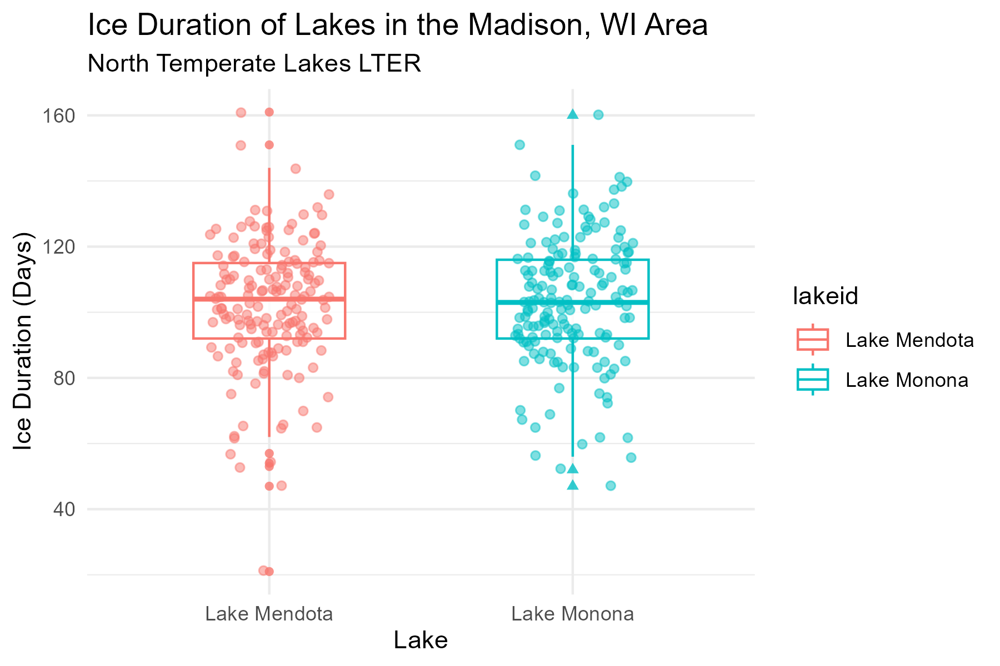
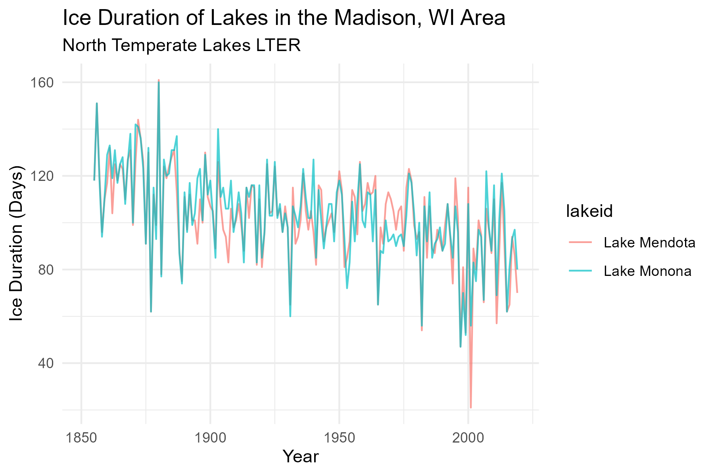

```{r, include = FALSE}
knitr::write_bib(x = c("rmarkdown", "knitr"), file = "references.bib")
```

## Introduction

Climate change has been of major concern globally, particularly in recent years. from 1905 to 2000, climate change has caused significant changes in Lake Mendotas [@mageeEffectsChangingClimate2016]. As temperatures have warmed, ice duration has decreased over time and a trend towards earlier ice melt dates have been identified [@ghanbariCoherenceLakeIce2009].

In this paper we will compare average ice duration in two lakes: Lake Mendota and Lake Monona.

## Results

The following are figures generated based on the data





A t-test found no significant difference (t = -0.56725, df = 328.98, p-value = 0.5709) for mean ice duration between the two lakes in the years 1852 and 2019.

## References
